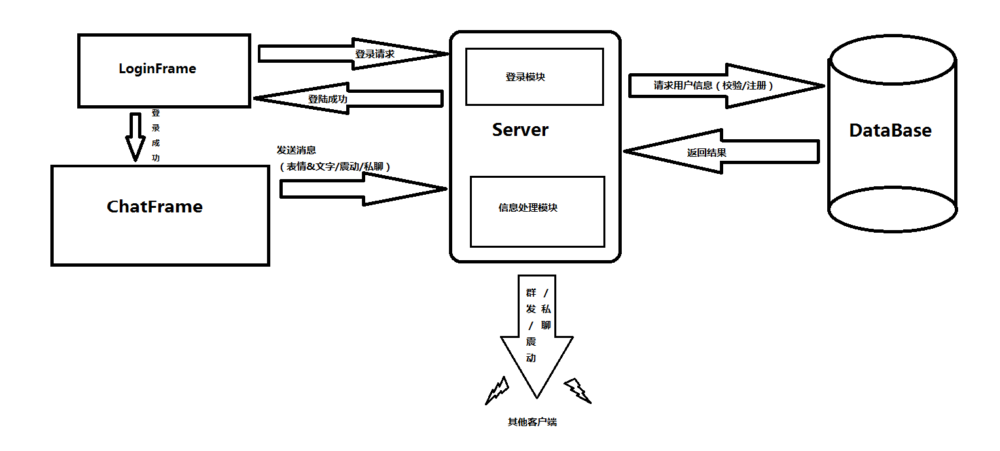

# Chatting Room

------

## 项目说明：

​	Java Swing即时通讯软件，包括服务器和用户两个部分，两者分别负责各自的逻辑，共同完成整个通讯的流程。通过平时对聊天软件的接触，基本实现常用的功能。通讯关键在于通过socket套接字进行UDP连接，以及表情编码，实现表情传输。

------

## Function：

(1) 用户具有注册和登录的功能（数据库）。

(2) 用户能够发送文字、预置表情、抖动窗口，私聊等功能。

(3) 服务器端实现处理登录、注册逻辑功能。

(4) 服务器具有群发、私发、抖动、转发文字及表情的能力。

(5) 聊天界面右侧放置在线用户列表，在用户登录、下线、上线自动更新。

(6) 点击用户列表可实现私聊功能。

等。

------

## Screenshot：

------

## Notice:

- 该项目为Java Swing编写的轻量级聊天软件
- 封面腾讯登录界面仅供学习使用，不得用作商业用途
- 软件分为服务器端和用户端两部分
- 使用JDK版本为1.8.0.111

------

## Instructions for use:

- 为方便使用JAR目录下放有编译好的可运行的jar包

- 本地测试请先运行Server后运行Client(ForLocal)

> 网络测试请在服务器端运行Server
>
> 并在源码src/sender/Sender.java 第11行修改为相应的IP地址
>
> 最后在本地打开Client(ForServer)

- FinalProject目录下为项目源码以及所有依赖Jar包

------

## Group:

- Chen Yu（10152510203@ecnu.cn）
- Shen HuaJie（10152510274@ecnu.cn）

------

## Note：

本项目参考了网络上的开源项目，并以此为基础进行增加、优化。
